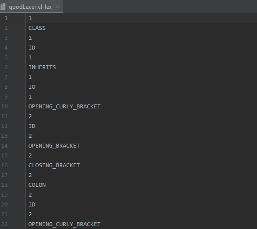
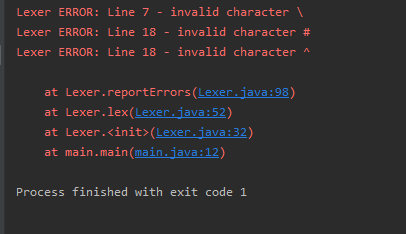

## COOL Compiler
##### The code is used to compile any program written in `COOL` language. 
It has 4 phases: **Lexical analysis**, **Parsing**, **Semantic analysis** and **Code generation** in three address code.
Each phase will ultimately result in a working compiler phase which can interface with the other phases.

## Installation:
##### - Use any IDE that runs Java language e.g. NetBeans, Eclipse, Intellij (preferred)
##### - Add Antlr plugin for intellij
##### - Run your grammar (COOL.g4): Use (goodLexer.cl) to run `COOL` code with no errors, output tokens will be inserted into (goodLexer.cl-lex)
Use (badLexer.cl) to run `COOL` code with errors, errors will be shown in console,
  path for good file is: Test Cases/goodLexer.cl
    
  path for bad file is: Test Cases/badLexer.cl

   change them from main file to run

## Structure:
#### **1) Lexical Analyzer:**
##### Describe the set of tokens for `COOL` in an appropriate input format and the analyzer generator will generate the tokens if the program has no errors in a file.cl-lex with the same name as input file (file.cl) or report an error. 
  
##### *Error reporting:*
ERROR: line_number: Lexer: message to standard output and terminate the program. 
  

#### **2) Parsing**

#### **3) Semantic analysis**

#### **4) Code generation**

