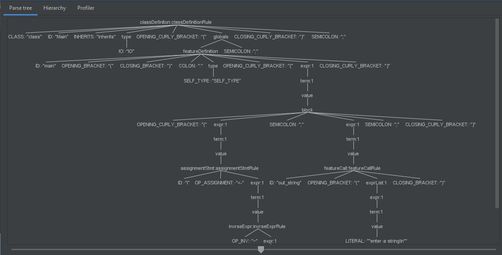

## COOL Compiler
##### The code is used to compile any program written in `COOL` language. 
It has 4 phases: **Lexical analysis**, **Parsing**, **Semantic analysis** and **Code generation** in three address code.
Each phase will ultimately result in a working compiler phase which can interface with the other phases.

## Installation:
##### - Use any IDE that runs Java language e.g. NetBeans, Eclipse, Intellij (preferred)
##### - Add Antlr plugin for intellij
##### - Run your grammar (COOL.g4): Use (goodLexer.cl) to run `COOL` code with no errors, output tokens will be inserted into (goodLexer.cl-lex)
Use (badLexer.cl) to run `COOL` code with errors, errors will be shown in console.
Path for good file is: Test Cases/goodLexer.cl
Path for bad file is: Test Cases/badLexer.cl
Change them from main file to run
   
##### -Running Parser: Use (goodParser.cl-lex) to run `COOL` code with no errors, output will be inserted into (goodParser.cl-cst). Use (badParser.cl-lex) to run `COOL` code with errors, errors will be shown in console.
Path for good file is: Test Cases/goodParser.cl-lex
Path for bad file is: Test Cases/badParser.cl-lex
Change them from main file to run.

## Structure:
#### **1) Lexical Analyzer:**

##### Describe the set of tokens for `COOL` in an appropriate input format and the analyzer generator will generate the tokens if the program has no errors in a file.cl-lex with the same name as input file (file.cl) or report an error. 

##### *Error reporting:*
ERROR: line_number: Lexer: message to standard output and terminate the program. 

#### **2) Parsing**

##### **Testing**
To test a grammar rule in (COOL.g4) file and assure syntax tree is produced. 

##### Unserializing the tokens produced by the _lexer stage_ and to serialize the Concrete Syntax Tree (CST) produced by parser if the program has no errors in a file.cl-cst with the same name as input file (file.cl-lex) or report an error.

##### *Error reporting:*

#### **3) Semantic analysis**

#### **4) Code generation**

##### We used _ **Doxygen** _ for documentation. _ **Doxygen** _ extracts documentation from source file comments. In addition to the Javadoc syntax, _ **Doxygen** _ supports the documentation tags used in the Qt toolkit and can generate output in HyperText Markup Language (HTML) as well as in Microsoft Compiled HTML Help (CHM), Rich Text Format (RTF), Portable Document Format (PDF), LaTeX, PostScript or man pages. Programming languages supported by _ **Doxygen** _ include _C_, _C++_, _C#_, _D_, _Fortran_, _IDL_, _Java_, _Objective-C_, _Perl_, _PHP_, _Python_, _Tcl_ and _VHDL_. Other languages can be supported with additional code.

